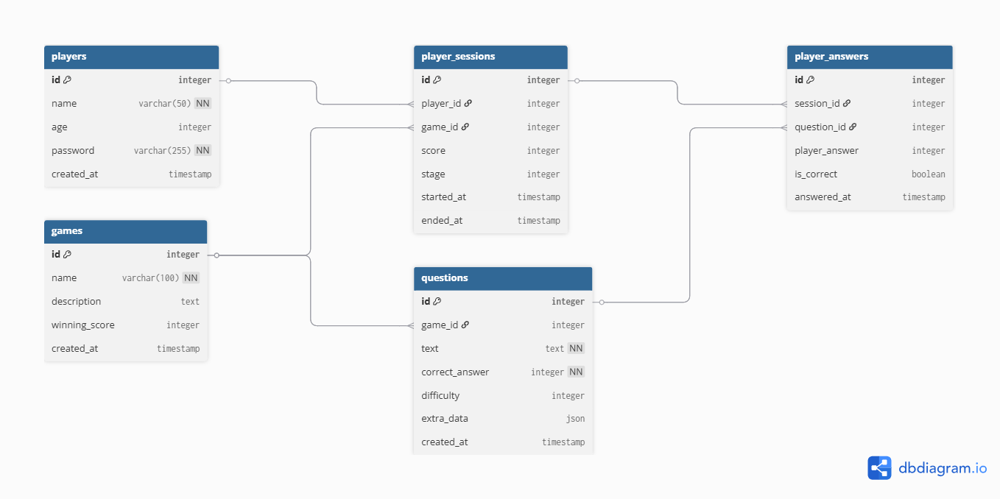

# Tommy Game - Math Quiz Platform

A web-based math quiz game platform built with FastAPI and PostgreSQL. Players solve math problems, progress through difficulty stages, and compete for high scores.

## Features

- 🔐 **User Authentication**: Secure signup/login with JWT tokens
- 🎮 **Math Quiz Game**: Dynamic question generation based on difficulty levels
- 📊 **Score Tracking**: Real-time score updates and session management
- 🏆 **Leaderboards**: Top player rankings
- 📈 **Player Statistics**: Historical performance tracking


## Tech Stack

### Backend
- **FastAPI** - Async Python Web framework
- **SQLAlchemy** - ORM for database operations
- **PostgreSQL** - Relational database
- **JWT** - Token-based authentication
- **Uvicorn** - ASGI server

### Frontend
- **Vanilla JavaScript (ES6 modules)** - Client-side logic
- **Jinja2 Templates** - Server-side HTML rendering
- **CSS** - Styling


## Setup Instructions

### Prerequisites
- Docker and Docker Compose installed
- Python 3.11+ (for local development)

### Using Docker (Recommended)

1.**Start the application** ( Builds Docker images and starts containers)
   ```bash
   docker-compose up --build
   ```

2. **Access the application**
   - Web UI: http://localhost:8000
   - API Docs: http://localhost:8000/docs

### Local Development

1. **Install dependencies**
   ```bash
   pip install -r requirements.txt
   ```

2. **Set up PostgreSQL database**
   - Ensure PostgreSQL is running
   - Update environment variables in `.env` file

3. **Run the application**
   ```bash
   python main.py
   ```

## Database Schema

