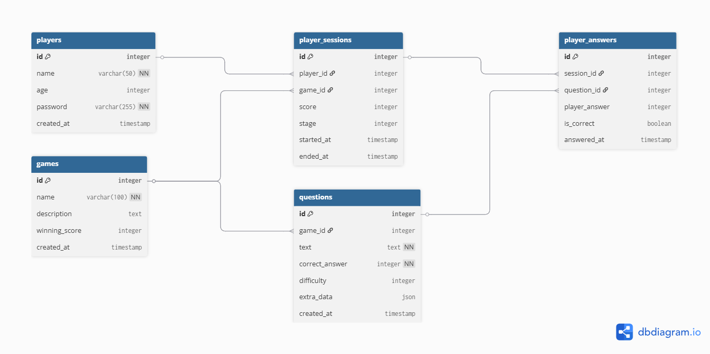

# Tommy Game - Math Quiz Platform

🎮 **[Play Now](https://tommy-game.onrender.com/game)**

A fun dinosaur-themed math quiz game for kids ages 5-9. Players solve math problems, collect dinosaurs, and compete for high scores.

> **About this project:** This was built as a learning exercise - primarily to explore AI-assisted development with [Cursor](https://cursor.sh) and [Claude](https://claude.ai). Some technology and architectural choices were made for educational purposes rather than purely for the needs of this specific app.

**Example questions:**
- `2 + 2 =` (beginner)
- `20 - 8 =` (advanced)

<p align="center">
  
  <br/>
  <em>Win rounds to collect dinosaurs like this one!</em>
</p>

## Hosting & Infrastructure (Free Tier)

| Service | Role | Free Limits |
|---------|------|-------------|
| **Render** | App hosting | 512MB RAM, 0.1 CPU - sleeps after 15min inactivity |
| **Neon** | PostgreSQL DB | 0.5GB storage - free forever |

## Features

- 🔐 **User Authentication**: Secure signup/login with JWT tokens
- 🎮 **Math Quiz Game**: Dynamic question generation based on difficulty levels
- 📊 **Score Tracking**: Real-time score updates and session management
- 🏆 **Leaderboards**: Top player rankings
- 📈 **Player Statistics**: Historical performance tracking


## Tech Stack

### Backend
- **FastAPI** - Async Python Web framework
- **SQLAlchemy** - ORM for database operations
- **PostgreSQL** - Relational database
- **JWT** - Token-based authentication
- **Uvicorn** - ASGI server

### Frontend
- **Vanilla JavaScript (ES6 modules)** - Client-side logic
- **Jinja2 Templates** - Server-side HTML rendering
- **CSS** - Styling


## Setup Instructions

### Prerequisites
- Docker and Docker Compose installed
- Python 3.11+ (for local development)

### Running locally with Docker

1. **Start the app**
   ```bash
   docker-compose up
   ```

2. **Open in browser** - http://localhost:8000

3. **If you made code changes and need to rebuild**
   ```bash
   docker-compose up --build
   ```

4. **Full clean rebuild** (if something is broken or dependencies changed)
   ```bash
   docker-compose build --no-cache
   docker-compose up
   ```

### Local Development

1. **Install dependencies**
   ```bash
   python -m pip install -r requirements.txt
   ```

2. **Set up PostgreSQL database**
   - Ensure PostgreSQL is running
   - Update environment variables in `.env` file

3. **Run the application**
   ```bash
   uvicorn main:app --reload
   ```
## 🧪 Running tests with Docker

To run the test suite (or a specific test file) **inside the application container**, use:

```bash
docker compose run web pytest tests
docker compose run web pytest tests/test_rate_limit.py
```

## Database Schema

